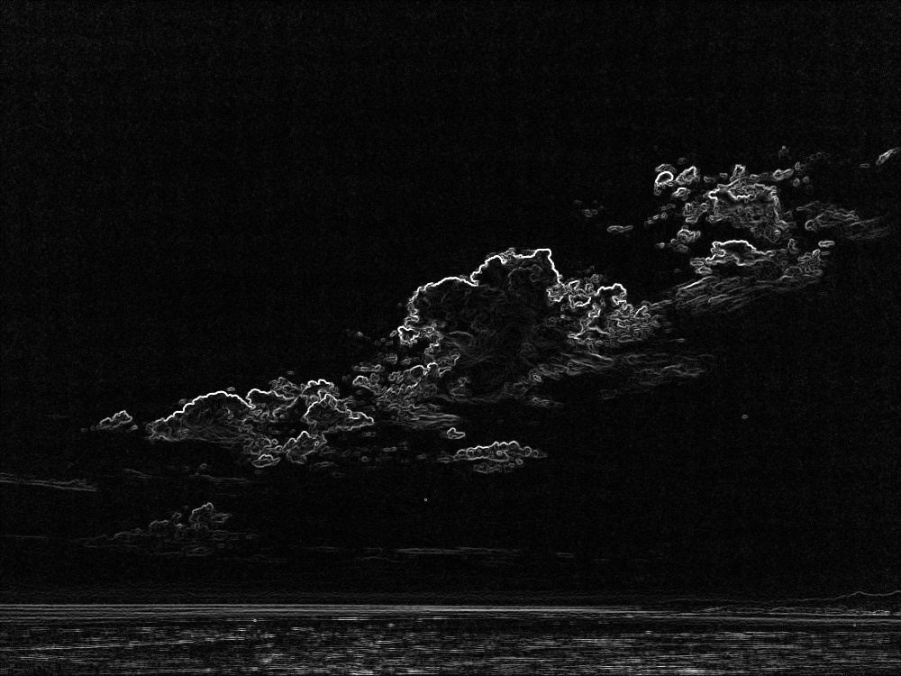
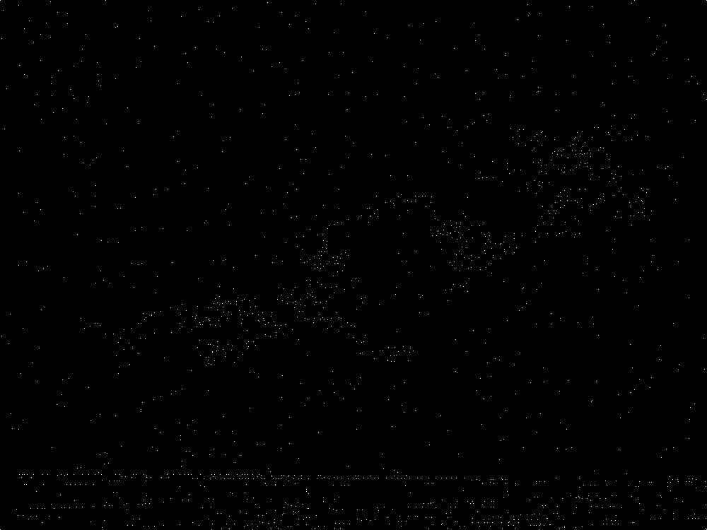
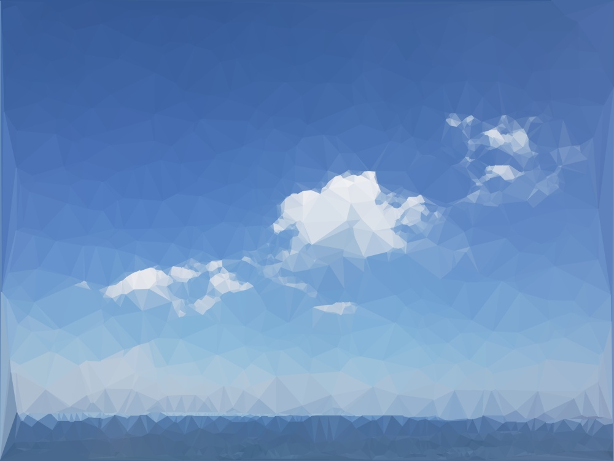

# lowpoly
An OpenCV, C++ project that generates an aesthetic "low-poly" rendition of an image using a Delaunay triangulation algorithm.

## Table of Contents
1. [Project Dependencies](#project-dependencies)
    - [OpenCV](#opencv)
    - [GUI Features](#gui-features)
2. [Usage and Options](#usage-and-options)
3. [Pipeline](#pipeline)
    - [Overview](#overview)
    - [Edge Detection](#edge-detection)
    - [Adaptive Non-Max Suppression](#adaptive-non-max-suppression)
    - [Delaunay Triangulation](#delaunay-triangulation)
    - [Color Extraction](#color-extraction)

## Project Dependencies
### OpenCV
[OpenCV](https://opencv.org/about/) is the premier open-source computer vision library. It abstracts and optimizes matrix operations commonly used in image processing and machine learning. For this project, the main modules (e.g. core, imgproc, imgcodecs, and highgui) should be sufficient. [Find Releases here](https://opencv.org/releases/) or search your favorite package manager. All this project cares about is that CMake can ```find_package``` it.

### GUI Features
Though this is primarily a CLI tool, it features GUI interactivity, so if you want that, be sure your environment can produce GUI windows (e.g. you may need to set up something like [X11](https://en.wikipedia.org/wiki/X_Window_System) if you are in a true CLI-only environment).

## Usage and Options
This tool allows for a high degree of customizability through command-line options (shoutout to [p-ranav/argparse](https://github.com/p-ranav/argparse) for the excellent library). For example, it may be desirable to downscale the input for better computational performance while upscaling the output to preserve sharpness and acuity. Other options apply to specific pipeline parameters and are given reasonable defaults. A brief description of the pipeline can be found below.
```
lowpoly [--help] [--version]
        [--output PATH] [--preproc-scale SCALE]
        [--target-input-width WIDTH] [--postproc-scale SCALE]
        [--target-output-width WIDTH] [--edge-threshold THRESHOLD]
        [--edge-aoe RADIUS] [--anms-kernel-range RANGE]
        [--salt-percent PROBABILITY] [--silent] [--interactive] [--all]
        FILE

Low-poly image generator.

Positional arguments:
  FILE                             Path to input image

Optional arguments:
  -h, --help                       shows help message and exits
  -v, --version                    prints version information and exits
  -o, --output PATH                Output image path
  -s, --preproc-scale SCALE        Initial preprocessing scale factor [default: 1]
  -w, --target-input-width WIDTH   Scale the input image to this size before processing (overrides -s)
  -S, --postproc-scale SCALE       Final postprocessing scale factor [default: 1]
  -W, --target-output-width WIDTH  Scale the output image to this size after processing (overrides -S)
  -t, --edge-threshold THRESHOLD   Minimum edge strength on the interval [0.0, 1.0] [default: 0.4]
  -a, --edge-aoe RADIUS            Area of effect of edges in adaptive non-max suppression [default: 5]
  -k, --anms-kernel-range RANGE    Range of adaptive non-max suppression kernel radius [default: "2-7"]
  -p, --salt-percent PROBABILITY   Frequency of random salt added prior to triangulation [default: 0.001]
  -q, --silent                     Suppress normal output
  -i, --interactive                Use GUI to preview and supply an interactive loop
  -a, --all                        Write all intermediate outputs to files
```

## Pipeline
<div align="center">
  
  <p><em>Original image (photo of the Central Coast in California, USA)</em></p>
</div>

### Overview
1. Read in image and apply any scaling.
2. Extract edge information via Sobel filter.
3. Extract vertex information from edge data via non-max suppression.
4. Pass vertices to Delaunay triangulation algorithm.
5. Extract triangles from generated graph.
6. Determine average color in each triangle.
7. Scale geometric information for output.
8. Stitch together mosaic of colored triangles for final output :)

### Edge Detection
- Uses [the Sobel operator](https://en.wikipedia.org/wiki/Sobel_operator).
- ```--edge-threshold``` applies to the magnitude of difference vector at each pixel
    - ```0.0``` &rArr; flat (i.e. no edge, zero vector)
    - ```1.0``` &rArr; maximum edge (e.g. between black and white regions, max Euclidean distance between pixel vectors)

<div align="center">
  
  <p><em>Edge data extracted via Sobel filter. Bright spots have stronger edges;dark spots are comparatively flat.</em></p>
</div>

### Adaptive Non-Max Suppression
- Radius of the kernel is adaptive based on proximity to strong edges
- ```--edge-aoe``` affects proximity effect (larger &rArr; greater area of effect)
- ```--anms-kernel-range``` affects the range to which edge effect is mapped
- ```--salt-percent``` affects the amount of random noise added afterwards

<div align="center">
  
  <p><em>Vertices extracted via adaptive non-max suppression. Random salt noise has been added as well to provide visual interest to the final output.</em></p>
</div>

### Delaunay Triangulation
- [What is it?](https://en.wikipedia.org/wiki/Delaunay_triangulation)
- ```delaunay``` module implements the divide-and-conquer technique [published by Guibas and Stolfi](https://dl.acm.org/doi/pdf/10.1145/282918.282923) with ```cv::Point``` as the payload data
- Uses the simplified data structure designed by [Ian Henry](https://ianthehenry.com/posts/delaunay/) (this is an incredible read with interactive graphics!)

<div align="center">
  
  <p><em>Delaunay triangulation of extracted vertices. Each triangle can be extracted from this graph representation through a recursive traversal.</em></p>
</div>

### Color Extraction
- Traverses Delaunay graph recursively to extract triangles
- Uses ```cv::mean``` with a mask to average color in each region
- Output can be scaled arbitrarily large (compute-bound) because extracted information is geometric before being rasterized

<div align="center">
  
  <p><em>The final output image: an aesthetically pleasing mosiac of colored triangles, recognizable as the original image.</em></p>
</div>


